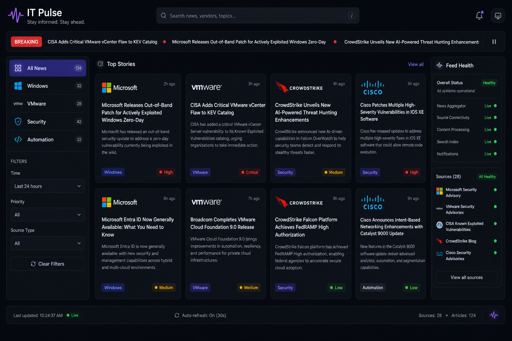

# IT Pulse

Live infrastructure news dashboard for IT engineers. Aggregates real RSS feeds from vendor blogs and industry news — Windows, VMware, CrowdStrike, Cisco UCS, PowerShell, Ansible, GitHub, Active Directory, and 30+ sources.

## Screenshots

| View | Preview |
|------|---------|
| [Dashboard](#) |  |


## Run

Requires **Node.js 20+**.

### Linux / macOS

```bash
git clone <your-repo-url>
cd IT-Observatory
npm install
npm run dev
```

Open http://localhost:5180

Production preview:

```bash
npm run build
npm run preview
```

### Windows

```powershell
git clone <your-repo-url>
cd IT-Observatory
npm install
npm run dev
```

Open http://localhost:5180

## Features

- **30+ live RSS feeds** from Microsoft, VMware, CrowdStrike, Cisco, GitHub, HashiCorp, Grafana, Splunk, Red Hat, and more
- **Category filters** — Windows, PowerShell, Identity/AD, VMware, Cisco, Security, Automation, DevOps, Cloud, Containers, Observability, Linux, Network, Industry
- **Auto-refresh** every 5 minutes
- **Feed health panel** — see which sources are live
- **Search** across all headlines
- **Breaking ticker** — latest headlines at the top

## Note on RSS fetching

During development and preview (`npm run dev` / `npm run preview`), feeds are proxied locally via `/api/rss`. A built static `dist/` folder alone cannot fetch RSS without a server-side proxy.

## Project structure

```
IT-Observatory/
├── src/               # React UI
├── media/             # README screenshots
├── vite-rss-proxy.ts  # Dev RSS proxy
└── README.md
```
